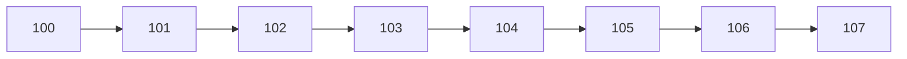
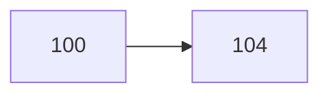
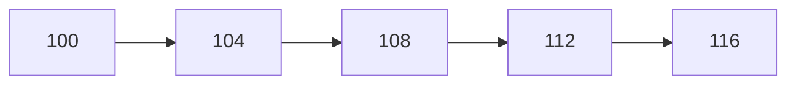
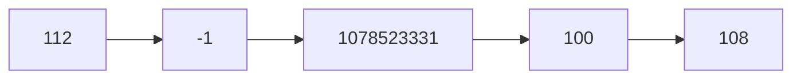
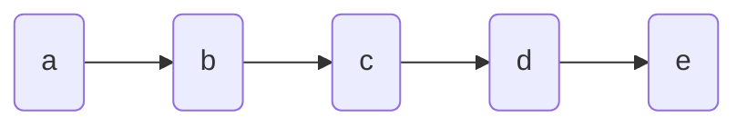
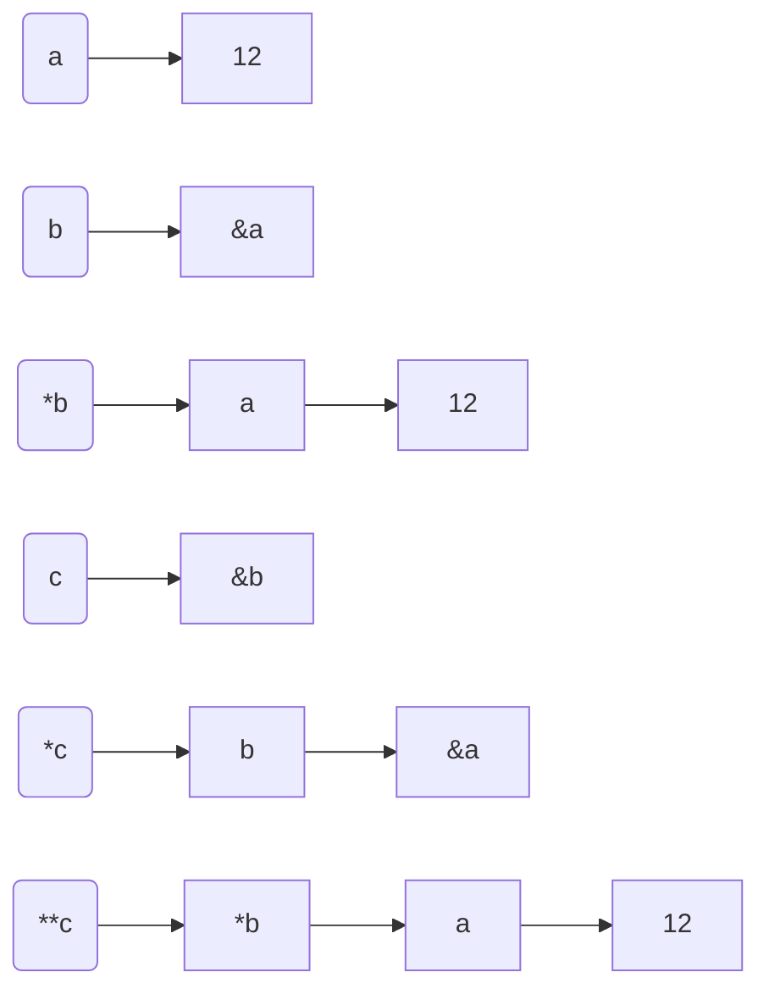

# 第一章	C语言概述

## 1.1	前言

2021届电协新生培训就从这里开始了，不知道诸君有没有自己在课外的时候了解过C语言，无论是有过一定基础的，还是一点都不了解的，我们都将从零基础带你们走进C语言的殿堂。本次培训参考书目《C Primer Plus》

## 1.2	简单的C语言示例

我们先来看一个简单的C语言的例子

~~~C
#include <stdio.h>
int main(void)								/*一个简单的C程序*/
{
    int num;								/*定义一个名为num的变量*/
    num = 1;								/*为num赋一个值*/
    
    printf("I am a simple ");				/*使用printf函数*/
    printf("computer.\n");
    printf("My favorite number is %d because it is first.\n", num);
    
    return 0;
}
~~~

虽然说这是一个比较简单的例子，但是我相信很多人看了之后一脸懵逼，这是什么鬼？接下来我们就来一步一步解析这个程序。但在这之前首先讲一下编程规范

## 1.3	编程规范

1. 示例程序的有的行的前面是有空白的，它是用tab键进行输入的，而不是用空格

2. 每一条语句占一行，并且在每一行的末尾都有结束标志——分号

3. 功能差不多的语句放在一起，比如说实例中有关printf的语句放在一起，有关盒子的定义的放在一起

4. 定义盒子的名称的时候，不要胡乱的定义，最好用他表示的含义的英文单词代替


## 1.4	示例解析

首先基本上每一个C语言都有一个固定的模板：

~~~C
#include <stdio.h>
int main(void)
{
    				/*这里是功能实现的代码*/
    return 0;
}
~~~

这里呢，你不需要理解固定模板为什么这么写，每个代表什么意思（想去了解的，自行阅读参考书目），你只需要知道每一个C语言的代码都必须要这些东西。

然后就剩下了这些代码：

~~~C
int num;								/*定义一个名为num的变量*/
num = 1;								/*为num赋一个值*/
    
printf("I am a simple ");				/*使用printf函数*/
printf("computer.\n");
printf("My favorite number is %d because it is first.\n", num);
~~~

阅读到这里的同学呢，我希望你自己用VC++6.0，书写一遍示例程序，然后运行，发现电脑输出的其实是这样一行代码：

~~~C 
I am a simple computer.
My favorite number is 1 because it is first.
~~~

这时候细心的你一定会发现，其实真正起作用的还是printf里面的东西，电脑把除去双引号的内容都打印出来了。因此你可能会意识到printf()和双引号都是一个固定的格式，输出的其实是里面的东西。那么这里就有了两个奇怪的地方。

第一，为什么输出的不应该是三行，而是两行？这里其实是\n的作用，它来表示换行。

第二，难道不应该是输出%d吗？为什么是1，而且右引号的后面的，num表示什么呢？其实你仔细看看就会发现，在程序的上面有一个num = 1。这个其实是“把1赋值给num的意思“这里的num像是一个盒子，你把1给了num，然后%d也像是一个盒子，它跟后面的num相互关联，表示把num的东西给了%d，于是%d不就是等于1了吗？

那么如此，最开始的int num 是什么意思呢？这句话就是说，我告诉电脑有一个盒子叫做num。因为电脑一开始并不知道num是什么，你得告诉他。

于是，我们就来举个例子：

~~~C
int num,Num;
num = 1;
Num = 2;

printf("My favorite number is %d.\n", Num);
~~~

他的输出是：

~~~C
My favorite number is 2.
~~~

注意C语言是区分大小写的，他告诉电脑有两个名字不同的盒子，最后输出的是数值为2的盒子。

## 1.5	结尾

这一章呢，主要是一个简单的介绍，让你们做一个简单了解。之后的章节呢，就会正式介绍C语言的有关知识了。这里呢，我就抛出几个问题，为后面的章节做一个简单的铺垫：

num = 1;表示赋值，阅读顺序是从后往前的，表示把1赋值给num，那么既然=表示赋值，什么符号表示等于的意思呢？

int num 叫做定义一个叫做num的变量，那么只能用int来定义变量吗？

%d 代表了num的数值，那么为什么%c不可以呢，%a不可以呢？

这些知识都会在后面进行讲解，有兴趣的同学可以配套着推荐书目，自行去预习，探索！

## 1.6	作业

对应推荐书目的本章最后面的"复习题"的第8题，第9题和“编程练习"的第1题和第2题。作业做完后可以自愿交给组长看看，没有截止时间。


# 第二章 数据和C

## 2.1 前言

相信在认真看完第一章C语言概述的内容后，参加2021届电协新生培训的同学都能够使用**printf()**函数轻松的打印出自己想要显示的一些基础信息，体会到自己去动手实践后的成就感。在本章你将学到如何去输入信息，而不是单纯的去打印信息， 学习C语言基本数据类型，本次培训参考书目《C Primer Plus》

## 2.2 简单的C语言示例

我们先来看一个简单的C语言的例子

~~~c
#include <stdio.h>

int main(void)  
{
    float weight; //你的体重
    float value;  //相等重量的白金价值

    printf("Are you worth your weight in platinum？\n");
    printf("Let's check it out.\n");
    
    scanf("%f",&weight);  //获取用户输入
    value = 1700.0 * weight * 14.5833;
    
    printf("Your weight in platinum is worth $%.2f.\n",value);
    printf("You are easily worth that! If platinum prices drop,\n");
  	printf("eat more to maintain your value.\n");
   
	return 0;
}
~~~

如果有不熟悉的内容别担心，接下来我们就来一步一步解析这个程序。首先我们先来讲一下C语言的数据类型

## 2.3 基本数据类型

### 2.3.1 类型

下表列出了关于标准整数类型的存储大小和值范围的细节：

| 类型           | 存储大小    | 值范围                                               |
| :------------- | :---------- | :--------------------------------------------------- |
| char           | 1 字节      | -128 到 127 或 0 到 255                              |
| unsigned char  | 1 字节      | 0 到 255                                             |
| signed char    | 1 字节      | -128 到 127                                          |
| int            | 2 或 4 字节 | -32,768 到 32,767 或 -2,147,483,648 到 2,147,483,647 |
| unsigned int   | 2 或 4 字节 | 0 到 65,535 或 0 到 4,294,967,295                    |
| short          | 2 字节      | -32,768 到 32,767                                    |
| unsigned short | 2 字节      | 0 到 65,535                                          |
| long           | 4 字节      | -2,147,483,648 到 2,147,483,647                      |
| unsigned long  | 4 字节      | 0 到 4,294,967,295                                   |

~~~c
例子一，使用int类型定义变量（想要定义整数的变量就用int）
    int x;   
	scanf("%d", &x);  //输出信息时""里使用%d格式
	printf("%d", x);  //打印信息时""里使用%d格式
例子二，使用float类型定义变量（想要定义小数的变量就用float）
    float x
    scanf("%f", &x);  //输出信息时""里使用%f格式
	printf("%f", x);  //打印信息时""里使用%f格式
	//也可这样打印 ，printf("%.2f", x); %.2f中的.2用于精确控制输出，指定输出的浮点数只显示小数点后面两位。
例子三，使用char类型定义变量（想要定义字符类型的变量就用char）
    char x;
	scanf("%c", &x);  //输出信息时""里使用%c格式
	printf("%c", x);  //打印信息时""里使用%c格式
~~~

### 2.3.2 16进制和2进制相互转换

~~~c
二进制：逢2进1；
由0和1组成
十六进制：逢16进1,
十六进制由0-9，A-F组成
与十进制的对应关系
0  1  2  3  4  5  6  7  8  9   A   B   C  D  E   F
0  1  2  3  4  5  6  7  8  9  10  11 12 13 14 15
贴士：十六进制一般会以“0x”开头，或者以“H”结尾。
0x是16进制的前缀，H是16进制的后缀
都是表示十六进制数，意义上没有什么区别，完全相等。至于什么时候用0x，什么时候用H，这取决于你在什么环境下使用，如果在C/C++，必须用0x来表示。
在C语言中是不能用H的.    
在数字后加一缩写字母后缀作为不同进制数的标识。各种进制数的后缀字母分别为：
B ：二进制数。
Q ：八进制数。
D ：十进制数。
H ：十六进制数。
对于十进制数通常不加后缀，也即十进制数后的字母 D 可省略。
二进制和十六进制转换前提
1.先了解二进制的8421
首先我们来看一个二进制数：1111，它是十进制的多少呢？
你可能还要这样计算：1×2º+1×2¹+1×2²+1×2³=1×1+1×2+1×4+1×8=15。
我们必须直接记住1111每一位的权值（又叫位权），并且是从高位往低位记，：8、4、2、1。 即，最高位的权值为2³=8，然后依次是 2²=4，2¹=2，2º=1。
记住8 4 2 1，对于任意一个4位的二进制数，我们都可以很快算出它对应的10进制值。
概念补充：基数:进位计数制中所使用的不同基本符号的个数称为该计数制的基数，比如十进制就是1.2.3.4.5.6.7.8.9.0这十个数，相对而言二进制就两个基数：0和1,八进制就是：0.1.2.3.4.5.6.7,十六进制就是：0.1.2.3.4.5.6.7.8.9.A.B.C.D.E.F
    位权：进位制中，把一个数中各位数字为1时代表的数值大小称为位权。如456它们的位权就是当各位为1时的数值大小，456中的4的位权就是10(2),5的位权就是10(1),6的位权就是10(0).     
通过二进制转十进制，十进制再转16进制的方法，间接实现二进制转16进制的过程
1111 = 8 + 4 + 2 + 1 = 15 =F
1110 = 8 + 4 + 2 + 0 = 14= E
1101 = 8 + 4 + 0 + 1 = 13= D
1100 = 8 + 4 + 0 + 0 = 12 =C
1011 = 8 + 0 + 2 + 1 = 11= B
1010 = 8 + 0 + 2 + 0 = 10 =A
1001 = 8 + 0 + 0 + 1 =9 =9
……
0001 = 0 + 0 + 0 + 1 = 1= 1
0000 = 0 + 0 + 0 + 0 = 0= 0
2.二进制转十六进制
有1得出
1111 1101 ， 1010 0101 ， 1001 1011
     F D ，        A 5 ，        9 B
这里需要注意的是，在向左（或向右）取四位时，取到最高位（最低位）如果无法凑足四位，就可以在小数点的最左边（或最右边）补0，进行换算：
10111.011 四位一拆可以拆成0001 0111.0110 转换为十六进制为 17.6 “.”小数点照着写就行
3.十六进制转二进制
同理也是十六进制转十进制，十进制转二进制，都是通过中间键十进制来转换
FD=15 13 = 8+4+2+1   8+4+0+1=1111  1101
总结:也许小伙伴有比此方法更快捷的方法，但是此方法也有优点
减少了记忆的量，只需要了解8421 ，便可二进制，十进制，十六进制自由转换
~~~


## 2.4 程序中的新元素

- 本例中使用了浮点型（float）的变量，以便处理更大范围的数据。float类型可以储存带小数的数字。
- 为了打印新类型的变量，在**printf()**中使用%f来处理浮点值。%.2f中的.2用于精确控制输出，指定输出的浮点数只显示小数点后面两位。
- **scanf()**函数用于读写键盘的输入。%f 说明scanf()要读取用户从键盘输入的浮点数，&weight告诉scanf()把输入的值赋给名为 weight 的变量。scanf()函数使用&符号表明找到 weight变量的地点。下一章将详细讨论&。就目前而言，请按照这样写。
- 也许本程序最突出的新特点是它的交互性。计算机向用户询问信息，然后用户输入数字。与非交互式程序相比，交互式程序用起来更有趣。更重要的是，交互式使得程序更加灵活。例如，示例程序可以使用任何合理的体重，而不只是156磅。不必重写程序，就可以根据不同体重进行计算。scanf ()和printf()函数用于实现这种交互。

## 2.5 使用数据类型

- 编写程序时，应注意合理选择所需的变量及其类型。通常，用int或float类型表示数字，char类型表示字符。在使用变量之前必须先声明，并选择有意义的变量名。初始化变量应使用与变量类型匹配的常数类型。例如:

~~~c
int apples = 3; /*正确*/

int oranges = 3.0 ;/*不好的形式*/
~~~

- 把一个类型的数值初始化给不同类型的变量时，编译器会把值转换成与变量匹配的类型，这将导致部分数据丢失。例如，下面的初始化:

  ~~~c
  int cost = 12.99;
  /*用double类型的值初始化int类型的变量*/
  float pi = 3.1415926536;
  /*用double类型的值初始化float类型的变量*/
  
  ~~~

  第1个声明，cost的值是12。C编译器把浮点数转换成整数时，会直接丢弃（截断）小数部分，而不进行四舍五入。第2个声明会损失一些精度，因为C只保证了float类型前6位的精度。编译器对这样的初始化可能给出警告。

## 2.6 本章小结

- C有多种的数据类型。基本数据类型分为两大类:整数类型和浮点数类型。通过为类型分配的储存量以及是有符号还是无符号，区分不同的整数类型。最小的整数类型是char，因实现不同，可以是有符号的char或无符号的char，即unsigned char或signed char。但是，通常用char类型表示小整数时才这样显示说明。

- 其他整数类型有short、int、long和long long类型。C规定，后面的类型不能小于前面的类型。上述都是有符号类型，但也可以使用unsigned关键字创建相应的无符号类型:unsigned short、unsigned int、unsigned long和unsigned long long。或者，在类型名前加上signed修饰符显式表明该类型是有符号类型.最后，_Bool类型是一种无符号类型,可储存0或1,分别代表false和true。

  注：详细学习，请配套着推荐书目，自行去探索！

## 2.7 作业

对应推荐书目第三章最后面复习题的1，5，10，编程练习题的2，5。作业做完后交给组长检查，周四前截止提交作业。


# 第三章	字符串和格式化输入输出

## 一、前言

在前面章节的 char 数据类型中讲述过单个宇符可以通过其字符的 ASCII 值保存在char 类型变量中。对于批量的**宇符型数据**（字符串），现在可以通过 char 类型数组来处理。本章我们将学习涉及有关字符串的相关问题和对格式化输入输出函数scanf()和printf()更深层次使用的讲解。本次培训参考书目《C Primer Plus》。


## 二、字符串的定义和使用

### 2.1字符串的定义

#### 2.1.1数组

​	首先我们要知道，c语言没有专门储存字符串的变量类型。这里我们就要引入一个概念“数组”，***数组是由连续的储存变量构成的一个集合***。定义一个数组的一般形式为：***数据类型  数组名[常量表达式];***

​	如：*int **<u>a</u>**[10]*  就代表**“**  定义了一个**数组**包含了**十个储存空间连续分布的int型变量  **”，单独作用于数组中的变量和作用于单个定义变量的方法是一样的。


##### 	**##注意##**

​	①数组大小定义好后，在程序运行过程中其大小不能改变！

​	②举例中数组名“<u>a</u>”同时表示此数组的首地址，a[0]表示第一个元素，并且该数组**最大下标**为9。

​	③使用大于**最大下标**的下标时，将访问数组以外的空间。那里的数据是未知的，可能带来严重后果。

#### 2.1.2字符数组

​	有了数组的概念我们就可以定义一个字符数组，用来存储字符，每个数组元素存放一个字符。如定义一个字符数组 char b[10];  该数组可以储存10个字符型变量。

#### 2.1.3字符串

​	在了解了字符数组之后，我们就可以引申到字符串。顾名思义，字符串就是“用双引号括起来的一串字符”，我们将它存储在字符数组中。**C语言规定，当字符串在内存中存储时，在每一个字符串的<u>结尾加一个“字符串结束标志\0”</u>，以便据此判断字符串是否结束。**

​	例如：字符串“china” 在字符型数组中储存形式为：

​	（易看出该字符串长度为6）


##### 	**##注意##**

​	①若没有**结束标志‘\0’**并且该字符数组空间未使用完，结果会出现乱码！

​	②因为有结束标志‘\0’的存在，这意味着**数组的容量必须至少比储存字符串中字符多1**。为了防止乱码情况发生，一般在定义数组时可以尽量定义大一点。

### 2.2字符串的使用

#### 2.2.1字符串的输入

​	从键盘输入：

​		①使用格式符**%s** 输入字符串。


​		②使用gets()函数（字符串专门的输入函数）

​			**格式：gets(储存读入字符串的位置);**

##### 	**##注意##**

​	①在**输入时**，不需要末尾添加‘\0’，因为scanf()函数和gets()函数在读取输入时就**已经自动添加了**。

​	②**scanf()函数**和**gets()函数**的区别在于，后者能读取从键盘输入的空格并存入数组中。这里值得注意的是，空格的ASCII值和‘\0’相同。所以在用scanf()函数读取键盘输入时，会把空格当做'\0'结束符，就无法读取并储存空格到数组中去。

#### 2.2.2 字符串的输出

​	由于字符串储存在数组中，数组又具有**有序性**，我们就会想到通过循环的方式将数组元素一个一个的printf打印出来，打印的指令为%c。然而这种方法较为复杂，所以就有了打印指令%s（string）。这个指令使用的前提必须是字符串，也就是说要是用%s打印一串字符，结尾必须要有结束符‘\0’。现在同样定义一个字符数组，我们要在屏幕上输出china。


①第一种输出方式变量为字符串首地址：


​	或者直接打印字符串的方法，


②我们在前面输入字符串中提到了gets()函数，同样的，我们能想到和它相反的另一个专门服务于字符串的函数puts()。

​	**格式：puts(储存字符串的位置);**


##### 	**##注意##**

​	①值得注意的是，同样是输出china第二种方法并没有添加\0，是因为，当我们printf指令是要输出一个字符串，计算机会自动将这一串字符结尾加\0并视为字符串，这种直接作用虽然简单，但是我们无法像将字符串放进数组那样，对这个字符串任意位进行操作！

​	②**get()函数和puts()函数只适用于字符串的输入和输出！**

#### 2.2.3 strlen()函数

​	①作用：计算字符串的长度。字符串的长度为第一个‘\0’之前的字符个数。

​	②格式：**strlen(字符串)**	

​	③注意：该函数会返回得到的字符串长度


## 三、预处理指令和符号常量的创建

### 3.1#define型常量

​	①格式：***#define 常量名 常量值***

​	②注意：结尾不用加分号，命名尽量全用大写区分用小写的变量（详细规则请看参考书《C Primer Plus》4.3）

### 3.2const型常量

​	①格式：***const 常量类型 常量名  = 常量值；***

​	②特点：一旦定义，值不能更改，具有<u>只读性</u>

## 四、输入输出函数

### 4.1输出函数printf()

​	前面章节中我们或多或少接触过printf()输出函数，以下我稍作总结：

​		①格式：printf("格式字符串", 待打印项1,  待打印项2, ...);

​		②在“格式字符串”中可以随意输入字符，只需要在需要打印的地方添上打印指令即可。**特别注意的是打印指令和引号后的待打印项必须是按顺序一一对应的**。不能出现未匹配的情况！

​		③如果只需要打印特定的句子，“格式字符串”中就**没有打印指令**，当然后面就没有待打印项了。

​		**④待打印项也可以是一个表达式！！！**

​		⑤该函数也有返回值，返回打印字符的个数，如果有输出错误，则会返回一个负值。

​		⑥在“格式字符串”中**“\n”**表示**换行字符**， **“\t”**代表**制表键**。

​		⑦百分号**‘%**’在“格式字符串”中为**转换字符**，若要打印一个百分号在屏幕上，则“格式字符串”中应输入“%%”，输出就为一个百分号。			（以下图片截自《C Primer Plus》4.4.2和4.4.3。**不建议背下来，最好在敲代码的时遇到具体情况查表熟悉**）


### 4.2输入函数scanf()

​	当我们需要每次运行程序时，需要通过输入不同的数据来观察程序运行的结果时，与printf()类似的scanf()就开始起作用了。以下我稍作总结：

​	①格式：scanf("格式字符串", 待打印项1的地址,  待打印项2的地址, ..., );

​	②关于变量（带打印项）的地址：⑴若为普通单独变量，则只需在变量前添加取地址符&即可。

​									  					    ⑵若为数组则不需要，数组名则为**首地址**。

​	③scanf中的“格式字符串”要求比较严格

​		⑴普通单独变量


​		⑵数组


​	④“格式字符串”中的空格


​	⑤scanf的返回值

​		scanf()函数**返回成功读取的项数**。如果没有读取任何项，且需要读取一个数字而用户却输入一个非数值字符串，scanf ()便返回0。当	scanf()检测到“文件结尾”时，会返回EOF(EOF 是stdio.h中定义的特殊值，通常用#define 指令把EOF定义为-1)。

## 五、本章小结

​	在本章我们学到：

​		①字符串的定义和使用

​		②五个函数（包括3个**字符串专用函数**strlen()、gets()、puts()函		数和2个**通用**函数scanf()和printf函数）。

​		③预处理指令#define和const创建符号常量的使用。

## 六、作业（1+4）

​	作业一：编写一程序实现以下功能：

​		从键盘上读入一行字符（字符中间可以穿插空格），在屏幕上输出该行字符的长度及内容(先输出长度，后输出内容)。


​	作业二：《C Primer Plus》第四章最后面复习题的2，5；编程练习题的5，6。

在这周日晚上之前提交


# 第四章 运算符 表达式 语句

 

## 4.1 运算符与表达式

 

C语言一共有34种运算符，10种运算类型，其中运算符又可大体分为逻辑运算符（表示运算对象的逻辑关系）、关系运算符（表示对两个·运算量进行比较，关系运算符结果为逻辑值(即真或假)）、算数运算附（完成基本运算的符号）、条件运算符等等，所谓表达式则是指运用运算符将两个表达式连起来表示相应运算的式子在写程序时需要注意各种运算符的优先级（具体可详见《C Primer Plus》附录D 运算符优先级）

 

常用的运算符可大致列为如下：

### 4.1.1.算术运算符：（+ ,-, /, %）

从左到右依次为加，减，除，取余

关于算术运算以及表达式示例：

2+3,6%3，运算结果依次为5和0

 

### 4.1.2.关系运算符：(> ,>= , ==, !=, <, <=)

从左到右依次表示大于，大于等于，等于，不等于，小于，小于等于的关系

PS：此处需注意，C语言中的等于是"=="而不是"=",前者是表示等于关系的运算符，后者是赋值号，两者要区分清楚.

关于关系运算符以及表达式示例：

 3 == 4，其结果为0（3和4并不相等，其结果对应逻辑值的假，也就是0）

 

### 4.1.3.逻辑运算符：（!, ||, &&)

从左到右依次为非运算，或运算，与运算计算规则为：两个计算二进制数，相同位为1则结果为真（1），否则为假（0）

，或运算规则为：相同位置的两个二进制数，有1结果就为真（1），否则就为假（0），此处需要同学们注意在C语言中非0即1的道理，因为计算机只能读0,1，不论是1,2,3,4,5,6……还是其他数字，只要不为0则结果就为1

关于逻辑运算符以及表达式示例：

（1）1 && 2，结果为1（与运算符左边为1，右边为2，不为0，则可以看成两个1做与运算）

（2）3 && 0，结果为0（与运算左边为3，不为0可看成1，与运算右边为0，则可看成1和0做与运算）

（3）0 || 3，结果为1,（或运算左边为0，右边为3，可看成1，则可看做是将0和1做或运算）

（4）!0，结果为1（!为非运算，0取非为1）

（5）!(取TRUE的条件）,结果为1（取TRUE条件结果为真，真取非则为0）

PS：此处需注意，逻辑运算对象不一定是具体数字，也可以是某一条件，对条件得是非判断得0或1以此做运算

大家可以思考一下，如何用C表示a的值大于三且小于四（正解： a <= 4 && a >= 3）

 

### 4.1.4.条件运算符（也称三目运算符）：（语法：条件表达式？语句1：语句2）

关于条件运算符以及表达式示例：

3 > 5 ? 2 : 3, 结果为3（条件语句是3>5,显然判断为假，若条件为假则结果为语句2，若结果为真则为语句1）

### 4.1.5.赋值运算符：（=， +=， -=， *=， /=, %=）

关于赋值运算符以及表达式示例：

（1）a = b, 结果a的值等于b的值

（2）a += b，则a 的值等于a = a + b（后面的-=，*=……同理）

 

## 4.2 语句

### 4.2.1 if语句的一般表示

在C语言中if语句有三种形式供大家选用，分别为if单支语句，if双分支语句，if多支语句.

一．if单支语句

语法：if（表达式）

​       语句1（想要在条件判断后做的事）

若表达式的结果为真（1），则执行语句1，若表达式结果为假，则不执行语句1

PS：if语句的表达式一般为逻辑表达式或关系表达式，也可以是其他表达形式

例如：比较两个数字，并输出叫大数

```C
#include <stdio.h>

int main(void)
{
    int a, b, max;
    a = 2;
    b = 5;
    max = a;
    if (a < b)
    {
		max = b;
    }
    printf(“%d”, max);
    
    return 0;
}
```


### 4.2.2if双分支语句

语法：

if（表达式）

​       语句1

else

​       语句2

if-else双分支选择性结构的执行过程为：若表达式为真（1），则执行语句1，若表达式为假（0），则执行语句2

例如：比较两个数字，并输出叫大数

```C
#include <stdio.h>

int main（void）
{
    int a, b, max;
    a = 2;
    b = 5;
    if （a > b）
    {
       max = a;
	}
    else
    {
        max = b;
    }

    retrun 0;
}
```

### 4.2.3 if多分支语句

​    语法：

if (表达式1)

​       语句1

​    else if(表达式2)

​       语句2

​    else if(表达式3)

​       语句3

​    else

​       语句4

if多分支语句中，若表达式1为真，则执行语句1，若表达式2为真则执行语句2，若表达式3为真则执行语句3，若表达式接不满足1，2，3式，则执行else语句中的语句4

PS：if多分支语句里面的分支个数可自行定义，并且满足一个表达式为真没执行了相应语句后，则if多分支语句终止，不再做后面else if中的表达式判断，详细例题如下（可应用于分段函数求值）


 

### 4.2.5 .if语句的嵌套

​    在if语句中的语句部分又包括一个和多个if语句，其判断顺序应该由外及里，先判断最外层的if语句条件，再依次判断每层的if语句。

### 4.2.6 switch语句的用法

Switch语句可以简单清晰的描述多分支结构,可用于涉及分支较多的情况

语法1：

switch（表达式）

​    case 常量1：语句1

​    case 常量2：语句2

……

​    case 常量n：语句n

​    default：语句n+1

 

语法2：

switch（表达式）

​    case 常量1：语句1

​       break；

​    case 常量2：语句2

​        break；

……

​    case 常量n：语句n

​       break；

​    default：语句n+1

 

在switch语句中首先先计算出表达式的值，再将表达式值与常量作比较，若与某一个常量相等，则执行该常量后对应的相应语句，若表达式中的值与各分支常量的值都不等，则跳转到default语句，语法1和语法2的区别是，语法1会将表达式值与每个常量从上至下，依次比较，而语法2的表达式值若与某一个常量比较结果为相等，则执行语句后的break，结束switch语句.

### 4.3 练习

完成习题4的第1，第2，第4小题.


# 第五章 C语言循环

## 一、在C语言中循环有3个，分别为：

1.**for**

2.**while**

3.**do while**

**在我们写代码时，有时候会遇到重复某一个操作很多遍的问题，这个时候，如果我们一个一个写就会显得非常麻烦，所以，我们引入了循环这一个概念，用极少的代码来实现重复的某一种操作，如从1加到100，每一次都是在做加法运算，就可以使用循环语句来实现**

## 二、在每个循环中，都会有以下内容：

**1.循环控制变量初始化**

意思是在执行这个循环之前会进行的操作。

**2.循环终止条件**

意思是执行循环所需要的条件，当条件不为真的时候，循环退出

**3.循环控制变量增（减）量**

意思是在每次执行完一次循环体之后会进行的一次操作

## 三、for循环

```c
for (循环控制变量初始化; 循环终止条件; 循环控制变量增量)
{
    (循环体)
}
```

### 循环执行步骤：

第一，	先进行循环控制变量初始化；

第二，	第二，执行循环终止条件，如果判断结果为真，则进入第三步；如果为假则循环终止并退出； 

第三，	执行循环体；

第四，	执行循环控制变量增量，转入第二步

如：

```c
for(a = 1; a <= 100; a++)
{
	x += a;
}
/*
******
在这个循环代码中，a = 1就是循环控制变量的初始化，a <= 100就是循环终止条件，a++就是循环控制变量增量,(a = 5)就是循环强制退出的条件
******
*/
```

**`注：for循环()中的三部分除了循环终止条件外，其他两部分都可以省略，但标准的for循环中，应该把循环控制变量的初始化，增量都放在()当中，并且在循环体中绝对不应该更改循环控制变量`**

## 四、while循环

用法为：

```c
循环控制变量初始化
while(循环终止条件)
{
    循环体
    循环控制变量增量
}

```

### 循环执行步骤：

第一，先进行循环控制变量初始化(在while之前)；

第二，判断循环终止条件，如果判断结果为真，则进入第三步；如果为假则不执行循环体；

第三，执行循环体；

第四，执行循环控制变量增量，转入第二步；

如：

```c
int main()
{
    int a = 0, x = 0;

    while(a < 10)
    {
    	x += a;
    	a++;
    }

    return 0;
}
//x的最终结果为45
```

## 五、do while（用的较少）

用法为：

```c
循环控制变量初始化
do
{
    循环体
    循环控制变量增量
}while (循环终止条件);
```

### 循环执行步骤：

第一，先进行循环控制变量初始化(在do while之前)；

第二，执行循环体；

第三，执行循环控制变量增量；

第四，判断循环终止条件，如果判断结果为真，则返回第二步；如果为假则直接退出循环；

如：

```c
int main()
{
    int a = 0, x = 0;

    do
    {
    	x += a;
    	a++;
    }while(a < 10)

    return 0;
}
```

## 六、 break和continue的用法

### 1、break

**break语句常用于退出当前的某种程序状态**

如，当程序执行循环的时候，外界的某个条件发生改变，需要终止该循环，但是此时循环终止条件判断还是为真，无法通过循环结束来退出，这个时候就需要使用break来强制退出该循环，一般情况下，我们只需要使用if语句来判断循环是否会被强制结束

`例：x = 600,自然数从小到大相加，当和大于这个数时加的最后一个自然数是多少`

代码如下：

```c
#include<stdio.h>

int main()
{
	int a = 0, x = 600, sum = 0;

	for (; a < 600; a++)
	{
		sum += a;
		if (sum > x)
		{
			break;
		}
	}

	printf("最后一个数字为:%d\n", a - 1);
    
    return 0;
}
//输出结果为34
```

**在这个题目中，我们并不知道循环到底需要执行多少次才会满足题意，所以我们只能让循环的终止条件在我们找到这个值之前不会为假，在我们找到这个值的时候再用break语句强制退出使循环终止**

### 2、continue

**Continue通常用在当某种条件满足或者不满足时continue下面的循环体语句不执行，但是循环还是要继续，只是满足这个条件时，循环体不执行，直接执行循环控制变量增（减）量，执行下一次的循环体**

`例：求0到100中所有不带9的数字的和`

代码如下：

```c
#include<stdio.h>

int main()
{
	int a = 0, sum = 0, a1, a2;

	for (; a <= 100; a++)
	{
		
		a1 = a / 10; //提取 a的十分位上的数
		a2 = a % 10; //提取个位数上的数字(%为求余符号)


		if (a1 == 9 || a2 == 9) //(当其中一个为9的时候不满足相加条件)
		{
			continue; //(结束当前循环体，执行循环控制变量增（减）量)
		}
		sum += a;
	}

	printf("和为:%d\n", sum);
	
	return 0;
}

```

以上就是c语言中循环的基本内容了

### 七：练习：

1.`分别用3个循环(for,while,do while)计算2的8次方的值，并且每执行完一次循环体之后将新的结果打印出来观察该值的变化，更加理解循环的作用，以及熟悉用法`

2.`利用break语句，当x = 1000,自然数从100递减（每次减1）加到0，当和大于x时加的最后一个自然数是多少`

3.`利用continue语句，求0到100中所有不带7的数字的和`

 

**注：练习题写完后可以交给组长查看**


# 第六章 C语言分支与跳转

现在你已经学习C语言一段时间了，你可能想要利用C语言处理一些更复杂的任务。

在本章中我们将学习C语言中的分支结构与跳转语句，以便让程序按照一定条件执行相应的动作。

## if...else...

if语句被称为分支语句，它的使用方法如下：

````c
if (条件表达式)
{
     在该条件下执行的内容;
}
````

if 被用于选择，从而使程序的一部分能够被执行，而另一部分不执行。

举例如下

````c
#include "stdio.h"

void main(void)
{
    int num1 = 1, num2 = 1, num3 = 0;
    if (num1 == num2)
    {
        printf("num1与num2相等\n"); // 在测试中输出了此结果，证明满足了num1==num2条件
    }
    if (num1 == num3)
    {
        printf("num1与num3相等\n"); // 在测试中没有输出了此结果，证明不满足num1==num3条件
    }
}
````

if 下也可以不加{}，那么if条件下只执行其下方的一行代码

````c
#include "stdio.h"

void main(void)
{
    int num1 = 1, num2 = 1, num3 = 0;
    if (num1 == num2)
        printf("num1与num2相等\n");
    	printf("123"); // 无论如何都会输出这一句话证明这一行代码并不在if语句的分支中
}
````

else语句被用于执行不满足if条件下的代码

````c
if(条件表达式)
{ 
    语句块1;
}
else
{ 
    语句块2;
}
````

在满足条件下，语句块1被执行，不满足时语句块2被执行

````c
#include "stdio.h"

void main(void)
{
    int num1 = 1, num2 = 0;
    if (num1 != num2)
    {
        printf("num1与num2不等\n"); // 在测试中输出了此结果，证明满足了num1!=num2条件
    }
    else
    {
        printf("num1与num2相等\n"); // 在测试中没有输出了此结果，证明不满足num1==num2条件
    }
}
````

同样，if...else...下都可以不加{}，那么条件下只执行其下方的一行代码

````c
#include "stdio.h"

void main(void)
{
    int num1 = 1, num2 = 0;
    if (num1 != num2)
        printf("num1与num2不等\n"); // 在测试中输出了此结果，证明满足了num1!=num2条件
    else
        printf("num1与num2相等\n"); // 在测试中没有输出了此结果，证明不满足num1==num2条件
    	printf("123"); // 无论如何都会输出这一句话证明这一行代码并不在else语句的分支中
}
````

如果我们要进行多次条件的判断，可以使用 else if

````c
if(条件表达式1) 
{ 
    语句块1;
}
else if(条件表达式2) 
{ 
    语句块2; 
}
else if(条件表达式3) 
{ 
    语句块3; 
}
... 
else 
{ 
    语句块n; 
}
````

最后else可以省略

举例如下

````c
#include <stdio.h> 
int main(int argc, char *argv[]) 
{ 
    int n = 40;
    
    //形式3：if...else if...else 
    if(n > 50) 
    {  
        printf("%d > 50\n", n);
    }
    else if(n == 50)
    {
        printf("%d = 50\n", n);
    }
    else
    { 
        printf("%d < 50\n", n);
    }
    
    return 0;
}
````

值得注意的是，if...else...语句在进行条件判断的时候，若可以确定结果，便不会进行下一步判断。

举个例子，

````c
#include "stdio.h"

void main(void)
{
    int num1 = 0, num2 = 1, num3 = 0;
    if (num1++ || num2++ || num3++)
    {
        printf("num1 = %d, num2 = %d, num3 = %d\n", num1, num2, num3); // num1 = 1, num2 = 2, num3 = 0
        //在第一个条件时，num1为0，逻辑上为假；num2在判断时为1，非0即真，已经可以得出这个表达式的结果为真，
        //故不用去看num3项是否为真，num3项不用执行，自然没有自增，仍为0
    }
    if (num3++ && num3++)
    {
        printf("num3 = %d\n", num3);
    }
    printf("num3 = %d\n", num3);// num3 = 1
    //因为在第一个num3++的时候num3仍为0，已经可以确定该表达式的结果为假，&&后的num3++便不会再执行，故num3只自增了一次
}
````


## switch...case...

对于多分支选择，我们也有其他方法

````c
switch（表达式）//表达式只能是字符型或整型的(short int int long int) 
{
 case 常量表达式1： 
    //语句1； 
    break； 
 case 常量表达式2： 
    //语句2; 
 	break； 
 //... 
 default： 
    //语句3； 
    break; 
}
````

运行顺序：将常量表达式的值语句switch后面的表达式的值对比，如果表达式的值刚好 等于case后面的某一个值，就会立即去执行case后的语句，如果都不是，则会执行default 后面的语句

 注意事项：

（1）switch后面的表达式不能是浮点型，只能是整形的 

（2）如果case后面的常量表达式与switch的表达式的值都不同，则执行default后 面的语句

（3）每一个case执行结束后通常会跟一个break，作用就是跳出整个switch 语句，break也可以不接，则从跳转的那一行语句开始，其下方的所有case语句都会被执行，直到遇到break或正常结束。

举例如下：

````c
#include <stdio.h> 

int main(int argc, char *argv[]) 
{ 
    int num = 2; 

    switch(num) 
    { 
        case 1: 
            printf("111111111111\n"); 
            //如果不加break，当要执行当前case语句时，执行完毕后悔接着下一个 
            //case后的语句执行，直到遇到break为止，否则会一直执行
            break; 
        case 2: 
            printf("222222222222\n"); 
            break; 
        case 3: 
            printf("333333333333\n"); 
            break; 
        default: 
            printf("hahahahahaha\n"); 
            break; 
    } 

    return 0; 
}
````

注意，通常switch...case...要比if...else...的执行效率高，因为switch…case会生成一个跳转表来指示实际的case分支的地址，而这个跳转表的索引号与switch变量的值是相等的，从而，switch…case不用像if…else那样**遍历条件**分支直到命中条件，而只需访问对应索引号的表项从而到达定位分支的目的。与if...else...相比，switch...case...属于典型的空间换时间（以提高空间复杂度为代价降低时间复杂度）


## goto

goto语句是无条件跳转语句，可以在**一个函数里**面实现代码的跳转，通常用于跳出异常等地方，正常情况下不建议使用，因为会使得代码逻辑混乱，可读性差。

举例：

````c
#include <stdio.h> 

int main(int argc, char *argv[]) 
{
    //使用goto实现跳转 
    printf("11111111111111\n"); 
    goto NEXT; 

    printf("22222222222222\n"); 

    printf("33333333333333\n"); 

    NEXT: 
    printf("44444444444444\n"); 
    printf("hello world\n"); 

    return 0; 
}
````


## 作业

### 1.从字符串中删除特定字符

编写一个程序，输入一段字符串，可以删除字符串中的某个字符并重新输出。

输入输出示例如下：

````c
Please enter a string:
a**bcdefg**t567)98
Please enter the char to delete:
*
The result:
abcdefgt567)98
````

其中，`a**bcdefg**t567)98`为我们输入的字符串，`*`为我们选择删除的字符，`abcdefgt567)98`为删除后的字符串。

### 2.工资计算

假设星期一至星期五每工作一小时的工资是20元，星期六和星期日每工作一小时的工资是平时的3倍，其中工资的4.5%是税金。试编一程序从键盘输入星期序号（1，2，3，4，5，6，7，分别表示星期一至星期天）和工作小时数，计算该日的工资及应交税金。

输入输出示例如下：

````c
please input the week number(1-7):5
please input the work hours(1-12):8
the salary is 160.00 ,the taxes is 7.20
````

其中`5`是输入的星期序号，`8`是当日工时，`160.00`为该日工资，`7.20`为税金


# 第七章——函数

我们的C语言培训已经快接近尾声了，现在向大家介绍C语言当中一个很重要的概念————函数。

在数学当中，我们的函数一般长这样*f(x) = 2x +1*，有了这样一个函数，我们只需要就可以用*f(2)*表示出2 * 2 + 1这样一个式子，大大简化了书写流程。在C语言当中也是差不多的，利用一个简单函数，我们就能实现对一些重复且机械的步骤进行重复，大大增加了代码的复用性和易读性。

## 1.简单函数的实现

现在假设我们需要打印一个这样的形状

1

11

111

1111

11111

如果我们没有函数

```c
#include <stdio.h>

int main(void) {
	int i = 0;

	for (i = 0; i < 1; i++) 
	{
		printf("1");
	}
	printf("\r\n");

	for (i = 0; i < 2; i++) 
	{
		printf("1");
	}
	printf("\r\n");

	for (i = 0; i < 3; i++) 
	{
		printf("1");
	}
	printf("\r\n");


	for (i = 0; i < 4; i++) 
	{
		printf("1");
	}
	printf("\r\n");


	for (i = 0; i < 5; i++) 
	{
		printf("1");
	}
	printf("\r\n");

	return 0;
}
```

是不是相当麻烦，如果我们有了函数的话

```c
#include <stdio.h>

void My_printf(int counts)
{
	int i = 0;
	
	for (i = 0; i < counts; i++) 
	{
		printf("1");
	}
	printf("\r\n");
}

int main(void) 
{
	My_printf(1);
	My_printf(2);
	My_printf(3);
	My_printf(4);
	My_printf(5);

	return 0;
}
```

是不是一下子就简单了不少，观察一下，我们干了什么？

首先是声明了一个函数，和变量一样，我们需要有一个类型，因为我们不需要返回值，所以类型为void，定义一个形式参数counts，为什么叫形式参数呢？我们可以观察到在整个程序当中我们并没有对其赋值，但是我们程序却运行的很正常，这是因为我们在调用它的时候传入了一个实际参数(例如My_printf(1)的实际参数就是1)，相当于把counts赋值1。


## 2.带有返回值的函数

思考一下，*f(x) = 2x +1*这样的函数我们应该怎么改写成一个函数？

首先我们要有形式参数x，以及我们得到f(x)后需要一个变量来存放它，所以再定义一个形式参数y。

```c
void Fuction1(int x, int y)
{
	y = 2 * x + 1;
}
```

这样我们就可以在程序里面调用它了：

```c
#include <stdio.h>

void Fuction1(int x, int y)
{
	y = 2 * x + 1;
}

int main(void)
{
    int input = 0, output = 0;//定义变量时最好带有初始值，不然每次都会是一个随机值，这样直接传入一个函数会出问题
    
    printf("Please input the x\r\n");
    scanf("%d", &input);
    Fuction1(input, output);
    
    printf("%d\r\n", output);
    
    return 0;
}
```

运行一下，发现不管怎么输入，结果一直为0。

这是为什么呢，细心的同学应该已经发现了，平时我们写的程序样子好像就是一个函数，我们一般称之为主函数，如**int main(void)**中int为函数类型，返回值return 0，程序结束整个变量就被清空了，你上次运行scanf出来的数值并不会保存，我们函数就像一个子程序，函数结束后就被释放，上面的例子当中我们将input和output传入了函数，赋给了x和y，我们执行了函数x和y的值(函数的形式参数)被改变，但input和output(函数的实际参数)却没有改变，所以输出的数值会一直是0。

和我们的主函数一样，我们自定义的函数也有返回值，因此我们可以用返回值来改变我们的output的数值，例如下面这样

```c
#include <stdio.h>

int Fuction1(int x)
{
	return 2 * x + 1;
}

int main()
{
    int input = 0, output = 0;
    
    printf("Please input the x\r\n");
    scanf("%d", &input);
    output = Fuction1(input);
    
    printf("%d\r\n", output);
    
    return 0;
}
```

运行一下，输入1输出3，和我们想实现的功能一样。

## 3.定义一个函数的两种方式

在上面的例子当中，我们在声明函数的同时就对函数进行了定义，但如果我们写的程序稍微长一点，我们可能就不能很清晰的看到找到我们需要调用的函数叫什么，主函数在哪也不好找到，因此我们可以像一个变量一样声明一个函数但不定义它，然后在别的地方再去对其定义，就像一个给一个变量赋值一样。

将上一个例程改下一下，如下:

```c
#include <stdio.h>

int Fuction1(int x);

int main()
{
    int input = 0, output = 0;
    
    printf("Please input the x\r\n");
    scanf("%d", &input);
    output = Fuction1(input);
    
    printf("%d\r\n", output);
    
    return 0;
}

int Fuction1(int x)
{
	return 2 * x + 1;
}
```

## 4.递归

C语言支持递归，即一个函数可以调用其自身。但在使用递归时，程序员需要注意定义一个从函数退出的条件，否则会进入死循环。

下面用阶乘举个栗子：

```c
double factorial(unsigned int i)//unsigned表示无符号的，这样的变量不能存放负数
{
   if(i <= 1)
   {
      return 1;
   }
   return i * factorial(i - 1);
}
int  main(void)
{
    int i = 0;
    
    printf("请输入一个数\r\n");
    scanf("%d", &i);
    
    printf("这个数的阶乘为 %.0f\n", factorial(i));
    
    return 0;
}
```

如果我们在函数里面用for循环来实现阶乘的话就会复杂不少：

```c
#include <stdio.h>
 
double factorial(unsigned int i)
{
	unsigned int j = 0;
	double op = i;
	
	if(i <= 1)
	{
	  return 1;
	}
	
	for (j = i; j > 1; j--)
	{
		i--;
		op = op * i;
	}
	return op;
}

int  main()
{
    int i = 0;
    
    printf("请输入一个数\r\n");
    scanf("%d", &i);
    
    printf("这个数的阶乘为 %.0f\n", factorial(i));
    
    return 0;
}
```

## 5.小结

现在让我们回头梳理一下一个函数有哪些部分：

在 C 语言中，函数由一个函数头和一个函数主体组成。下面列出一个函数的所有组成部分：

+ **返回类型：**一个函数可以返回一个值。**return_type** 是函数返回的值的数据类型。有些函数执行所需的操作而不返回值，在这种情况下，return_type 是关键字 **void**。

- **函数名称：**这是函数的实际名称。函数名和参数列表一起构成了函数签名。
- **参数：**参数就像是占位符。当函数被调用时，向参数传递一个值，这个值被称为实际参数。参数列表包括函数参数的类型、顺序、数量。参数是可选的，也就是说，函数可能不包含参数。
- **函数主体：**函数主体包含一组定义函数执行任务的语句。

在第二个例子当中展示了实参和形参的区别，如果函数要使用参数，则必须声明接受参数值的变量。这些变量称为函数的**形式参数**。

形式参数就像函数内的其他局部变量，在进入函数时被创建，退出函数时被销毁。

当调用函数时，有两种向函数传递参数的方式：

+ 传值调用： 该方法把参数的实际值复制给函数的形式参数。在这种情况下，修改函数内的形式参数不会影响实际参数。

+ 引用调用： 通过指针传递方式，形参为指向实参地址的指针，当对形参的指向操作时，就相当于对实参本身进行的操作。

因为还没有讲到指针，我们现在只使用传值调用来传递参数，这意味着函数内的代码不能改变用于调用函数的实际参数。

## 6.示例——任务选择

```c
#include <stdio.h>
#include <windows.h> //Windows窗口

void task1(void);
void task2(void);
void task3(void);
void task4(void);

int main(void) 
{
	int choice = 0;
	
	while (choice != 5) 
	{
		printf("please input the num(0-5) to choose \r\n");
		printf("1.task1	2.task2 3.task3 4.task4 5.exit\r\n");
		scanf("%d", &choice);
		switch (choice) 
		{
			case 1:
				task1();
				break;
			case 2:
				task2();
				break;
			case 3:
				task3();
				break;
			case 4:
				task4();
				break;
			case 5:
				return 0;	
			default:
				printf("system error! please input again");
				break;
		}
		system("pause");
		system("cls");//清空控制台
	}
	return 0;
}

void task1(void)
{
	printf("task1 is runnig\r\n");
}

void task2(void)
{
	printf("task2 is runnig\r\n");	
}

void task3(void)
{
	printf("task3 is runnig\r\n");
}

void task4(void)
{
	printf("task4 is runnig\r\n");	
}
```

上述程序我们就可以通过键盘输入数字选择不同的任务运行，C语言是一门**面向过程**的语言，一个程序要实现的功能可以被划分为一个又一个小过程，通过一个又一个函数来进行实现，这在日后我们学习单片机时常常需要用到。


## 7.课后作业

对应推荐书目第九章最后面复习题的1，7，9，编程练习题的1，2，4。作业做完后交给组长检查，下周日前截止提交作业。


<h1>结构体与指针</h1>

<h3><h3><span name = "232">知识点</span></h3>


<h4>重点</h4>

<h4><a href="#233">结构体与指针的学习</a></h4>

<h4>选修</h4>

<h4><a href="#234">函数指针与指针函数的区别</a></h4>

<h4><a href="#236">函数指针的应用（回调函数与转换表）</a></h4>

<h4>扩展</h4>

<h4><a href="#237">面向对象的编程方式</a></h4>

<h3><a href="#245">作业</a></h3>


<h3>前言
<h4><font color = 'green'>书接上回(我越哥的)，这是最后一次C语言培训，我将分享一些小知识，一天写完这些，可能会有一些错误，发现错误可以向组长反馈，大家好好坚持。本章可以分段观看。</font></h4>


<h3><span name = "233">结构体与指针的学习</span>


<h4> <a href="#215">1.指针</a>


<h4><a href="#216">2.结构体</a>


<h4><span name = "215">1.指针的学习</span></h4>

<h5><a href="#211">(1)内存的了解</a>


<h5><a href="#212">(2)指针</a>


<h5><a href="#213">(3)指针的使用</a>


<h4><font color =  'green'>关键词：指针就是地址<h3><span name = "211"></span></font></h4>


<h4><font color = 'blue'><span name = "211">(1)内存的了解</span></font></h4>


<h4>讲到指针就离不开对内存的学习，我们把计算机的内存看作一排房屋，每座房子都可以容纳数据，并通过一个房号来标识（如100）




<h4>上面的每一个房屋(每一位)可以容纳0或1，但是一位能表示的值太小了，我们可以把许多位合在一起，作为一组，这样就可以存储较大的数值。




<h4>（这里的100房屋就包括了100，101，102，103这四位，104依此类推）</h4>

<h4>这样我们就可以通过这个<font color = 'blue'>房间号100</font>找到我能存储数据的这四位，而在实际中，许多机器是以字作为单位存储整数的，每个字一般由两个或者四个字节组成，如上图房间号100就不再是存放四位数据（bit）,而是存放四个字节（byte）的数据。这样一个房屋就可以存放更多的数据了。</h4>

<h4>那么我就可以通过房间号100这个存储四字节的房子，那么我们再看看一个例子<span name = "220">（图2）</span></h4>






<h4><font color = 'red'>（上面的图表示房子100，房子104...房子108,同时下面的表示这个房子内的数值，如房子100内存放着112这个数字）</font></h4>

<h4>现在我们就可以根据房间号找到我们在这个房间内存放的数据，但是这样子在实际中是很困难的，所以我们在C语言中可以使用<font color = 'blue'>变量（名字）来代替地址（房间号）</font></h4>



<h4>现在我们使用a,b,c,d,e相应的替代房间号100，104，108，112，116</h4>

<h4>而实际中这些地址与变量的关系是有编译器为我们实现的，但是在硬件上仍然是通过地址访问内存位置的</h4>


<h4><font color = 'blue'><span name = "212">(2)指针</span></font></h4>


<h4>这里我们已经初步认识到在C语言内，我们是怎么存储数据的，怎么访问内存的。下面就是指针的介绍：</h4>

<h4>	指针也就是内存地址，指针变量是用来存放内存地址的变量。就像其他变量或常量一样，您必须在使用指针存储其他变量地址之前，对其进行声明。指针变量声明的一般形式为


```c
type *var-name;
```

<h4>在这里，<font color = 'red'>type </font>是指针的基类型，它必须是一个有效的 C 数据类型，<font color = 'red'>var-name</font> 是指针变量的名称。用来声明指针的星号 <font color = 'red'>*</font> 与乘法中使用的星号是相同的。但是，在这个语句中，星号是用来指定一个变量是指针。以下是有效的指针声明：


```c
int 	a  = 112, b = -1;
float 	c  = 3.14;
int		*d = &a;
float 	*e = &c;
```

<h4>这里是对应<a href="#220">图2</a>，大家可能发现图中c这个位置（也就是地址108）这里的存放的数据是1078523331，但是我们刚刚声明的float c = 3.14 这里c中的数据为什么不是3.14，这里要注意浮点数和整数存储是一样的，地址内存储的只是每一位是0还是1，而你定义该数据的类型为整型，那么他就会被解释为整型，如果是浮点型，就会被解释成浮点数。这里就有一个重要的结论：<font color = 'red'>决定数值的类型不是这个值的位数，而是通过这个值的使用方式</font></h4>

<h4>现在我们开始讨论指针, 指针的初始化是使用&操作符完成的，这个操作符用于产生操作数的内存地址。


<h4>我们重点看d和e这两个指针变量，d和e的内容为房间号100和房间号108，而这就是上面我们对d和e定义是一致的。这里我们不看<font color = 'red'>*</font>这个操作符，那么d的值就为100， e的值为108，也就是a和c的地址。这里不要认为d和e会等于112，3.14，声明为指针变量不会改变求值方式：一个变量的值就是分配给这个变量内存位置多存储的数值。相<a href="#220">图2</a>中一样，d和e里只存放了100和108.</h4>

<h4>指针的真正作用就是访问地址，我们通过一个指针访问他所指向的地址的过程称为<font color = 'red'>间接访问或解引用指针</font></h4>

<h4>而这个执行间接访问的操作符就是单目操作符<font color = 'red'>*</font>


<h4>那么现在我们就可以知道*d的真正的意思，访问d存储的数值（地址），那就是地址112存储的数值，*d的数值就是a的值


<h4>现在我们已经知道指针是什么了，就是间接访问地址，我们平时int a = 112;那么a变量所对应的地址下存储的就是112这个数值，d这个指针变量使用*操作符，就可以间接访问a的地址。这就是指针的作用。</h4>

<h4>大家已经了解指针了，现在就可以开始使用他了,向C语言内其他变量一样，指针也需要初始化。那么我们看下面一个例子：


```c
int 	*a;
*a  = 	12;
```

<h4>这里声明了一个指针变量a，把12这个数值存储在a的存储空间内，可能会有人认为就是把<font color = 'red'>地址12</font>赋给a，然后*a就是间接访问地址12存储的数值。但是在现实中，我们在这里是无法知道每个地址是否存在且这个地址是否存储数值。又或者会认为我们把<font color = 'red'>12这个数值的地址</font>赋给a变量，但是这也是不可能的，我们在这里无法知道12这个值存储在什么地方。</h4>

<h4>(那这样赋值后，对于指针初始值是非法的，程序会报错，这个错误可能会是“段错误”或者“内存错误”)</h4>

<h4>这里介绍一种特殊的指针变量<font color = 'red'>NULL</font>，他表示不指向任何东西。这是一个很有用的变量，在后面的各种间接引用的过程中都必须先保证指针不是NULL。而且我们也可以在知道指针初始化的地址时将这个地址赋给这个指针变量，但是当我们不知道时，可以把这个指针变量初始化成NULL</h4>


<h4><font color = 'blue'><span name = "213">（3）指针的使用</span></font></h4>


```c
int 	a;
int 	*d = &a;

*d  = 10 - *d;
d   = 10 - *d;
```

<h4>这里对下面两条运算语句进行讨论，第一句没毛病，使用了两个间接访问操作，d所指向的位置（a）得到右边的计算结果，这里是右边计算完再赋值给左边。而第二局就很明显的问题，d是一个指针变量，而右边为整型，两边数据类型不同，肯定是编译不过的。*d可以看作a,那么对于右边是整型会好理解一些，10 - a很明显就是整型的。</h4>

<h4>我们再看一个例子:</h4>

```c
*&a	= 25;
```

<h4>这是什么意思呢？ 我们访问a的地址，然后存入25这个数值。这就是这句话的意思，也就是说这句话等同于a=25，那么为什么我们平时并不使用这种方式进行赋值呢？ 因为这种方式不仅会减低你的代码的可读性，而且也会使编译器产生额外的操作，这样的代码更大，更慢。不是我们希望的结果</h4>

学到这里，你可能会觉得这指针就只能这样了吗？那么再看一个例子：

```c
int 	a 	= 12;
int 	*b	= &a;
int		**c	= &b;
```

<h4>那么这时候**c到底等于多少呢？</h4>



<h4>如图所示
<h4>c这个指针变量我们可以称之为指向指针的指针，也就是说我们使用指针可以无限的指下去，比如******c,我们遵循从左到右的原则（这个指针变量是合法的前提下），就还是可以得到这个指针变量的数值的。（这里已经写到放飞自我了）</h4>


<h4>指针的初步介绍就到这里了，下面就是结构体的介绍了


<h4><a href="#232">回到目录</a></h4>


<h3><span name = "234">函数指针与指针函数的区别（选）</span>


```c
1	int f(int );    
2	int (*pf)(int) = &f;    
3	int* ff (int ); 
```

<h4>第一道函数就是我们平时普通的函数，而第二个就是函数指针，第三个就为函数指针。


<h4><font color = 'red'>指针函数本质是一个函数，其返回值为指针。函数指针本质是一个指针，其指向一个函数。


<h4><a href="#232">回到目录</a></h4>


<h4><span name = "216">2.结构体基础知识</span></h4>

<h4>当我们需要能够同时存储一个以上单独数据时，C语言为我们提供了两种类型的聚合数据类型：数组和结构。数组之前已经学过了，我们在本章只讨论<font color='red'>结构</font>这个类型。</h4>

<h4>结构顾名思义就是一些值的集合，那么反过来这些值就是他的成员。而在一个结构体里每个成员都能时不同的类型。那么问题来了，假设我已经创建了一个结构体并且声明了各个成员的类型了，<font color='red'>我该如何访问这些成员呢？</fonr></h4>

<h4>之前学习的数组中，我们可以通过下标访问数组中的元素。可是这样的访问前提是我们的数组长度是固定且已知的，你可以随心所欲的对该数组内任意一位数据进行操作。但是在结构体中长度是不同的，且每个成员长度也是不同的，那我们该怎么访问呢？ 结构体每个成员都有他的名字，<font color = 'red' >我们可以通过名字来访问他们。</font></h4>

<h4>像这样</h4>

```c
struct EXAMPLE {
    float 	FirstMenber;
    int   	SecondMenber;
    char	ThireMenber[20];
};

EXAMPLE FirstStruct 		= {0};
FirstStruct.FirstMenber 	= 1.1f;
FirstStruct.SecondMenber	= 1;
```

<h4>那么我们就此展开结构体怎么使用</h4>

<h4>1.结构体的声明</h4>

<h4><font color = 'green'>关键字： struct</font></h4>

<h4>相上面的例子一样，我们要把所有的成员都包含在这个结构体中，并且每个成员都有他的名字和类型（类型也可以是指针，结构体，联合体，枚举体）。</h4>

<h4>那么当我们声明创建了两个具有相同的成员的结构体，例如：</h4>

```c
struct {
    int 	a;
    char	b;
    float	c;
}x;
struct {
    int 	a;
    char	b;
    float	c;    
}y[20], *z;
```

<h4>那么这两个会不会被编译器当作相同类型的东西呢？比如z = &x(这里的*z就是结构体指针)，这里暂时认为为z能否等于x，就像</h4>

```c
int 	Newx = 0;
char 	Newz = 0;
Newx = Newz;
```

<h4>Newx与Newz两个变量类型不同是无法编译通过的。上面的z=&x跟这个是一样的，都是两种不同类型的结构体，编译是无法通过的。Newx与Newz两个变量类型不同是无法编译通过的。上面的z=&x跟这个是一样的，都是两种不同类型的结构体，编译是无法通过的。</h4>

<h4>这里也就说明了即使是成员完全相同的结构体在编译器眼里也是两个不同类型的结构体。
<h4>学到这里，我们可能会有一个疑问：我难道使用结构体只能向上面一样，每次在结构体后声明。这很明显不是一个好的方法，我们可以给这个结构体起个名字，这样我们后面就可以使用这个名字来声明结构体。例如：<span name = "217"></span>


```c
struct SIMPLE {
    int 	a;
    char	b;
    float	c;
};
```

<h4>这里的标签可以理解为你创建了一种类型标签，后面我们就可以使用这个类型标签：


```c
struct STMPLE x;
struct STMPLE y[20], *z;
```

<h4>这些结构体就是同一种类型的了，但是这里的标签并不是类型。如果我们想要创建一种结构体类型，就可以使用typedef创建一种新的类型：</h4>

```c
typedef struct {
    int 	 a;
    char	 b;
    float	 c;    
} Simple;
Simple x;
Simple y[20], *z;
```

<h4>现在这个Simple就再也不是结构标签了，而是一个类型，像int, char, float一样。


<h4>上面这两种声明方式的区别就是，第一种只是给这个结构体起了个名字，就像标签一样，你不需要在像一开始一样在声明结构体，可以使用这个标签在任意地方使用这个名字的结构进行声明，而第二种就是创建了一种结构体类型，后面的使用就像int,char,float这些一样。（这句话可能有点没表达清楚，可以对比一下三种结构体声明方式）


关于结构体的成员这里再补充一点，我们可以使用结构体作为我们结构体的成员

```c
struct COMPLE {
    float 	f;
    int 	a[20];
    struct  SIMPLE s;
    struct  SIMPLE sa[10];
};
```

<h4>这里细心的同学可能会问，我前面不是声明SIMPLE这个标签的结构体中有 int a;(<a href="#217">SIMPLE</a>),这不会与我们现在COMPLE的成员a冲突吗？


<h4>这也是结构体中的一个规则：<font color = 'red'>一个结构的成员的名字可以与其他的结构体成员的名字相同。


<h4>ok,学到这里我们已经会了如何声明结构体了，那么我们还要学习如何使用他。


<h4>2.结构体的成员访问与引用


<h4>1.直接访问


```c
struct COMPLE comp;
comp.f = 1.0f;
comp.sa[4].c
```

<h4>第一句应该很容易理解，就是使用COMPLE标签的结构体comp的成员float f。而第二句话稍微复杂一点，sa[10]就是声明了一个长度为10的SIMPLE标签的结构体的数组，然后访问这个数组第5个的成员c。这里可能会有同学关系这个下标与。的优先级对比，他们优先级相同，所以直接从左到右看就行了。


<h4>2.间接访问<h4>


<h4>前面已经学习了函数，那么我们声明一个函数为


```c
void func (struct COMPLE *cp);
```

<h4>这里我们再这个函数中就可以通过 （*cp）.f来访问这个结构体的成员，同时我们也可以使用cp->f来访问成员。
    而这里的结构体指针本质上和我们前面讲的指针是一样的。


<h4><a href="#232">回到目录</a></h4>

<h4>3.结构体的自引用（扩展）


<h4>这个知识点再后面数据结构中学习链表是一个重点，再这里扩展一下。


<h4>我们看下面这两个例子：


```c
struct SIMPLE1 {
    int 	a;
    struct	SIMPLE1	b;
    int		c;
};

struct	SIMPLE2	{
    int 	a;
    struct SIMPLE2 *b;
    int		c;
};
```

<h4>我们直接看过去这两者只有一个区别，那就是第一个里面使用了自己这个标签的结构体作为成员，而第二个是使用了一个结构体指针作为成员。


<h4>第一个仔细一看就会有一个疑惑，我声明后就会再这个结构体内再度建立一个结构体b, 而b也是这种标签的结构体，那么他就会再度建立一个b，这样陷入死循环，肯定是不对的，是非法的声明。


<h4>但是第二个确实正确的，合法的。那这是为什么呢？


<h4>我们在第二种声明中成员是结构体指针，那么他就是一个指针变量，而指针变量才是他真正的变量类型，那么他的长度是确定的，这里先普及一个定义：<font color = 'red'>指针的类型和指针所指向的类型说明</font>


<h4>从语法的角度看，你只要把指针声明语句里的指针名字去掉，剩下的部分就是这个指针的类型。这是指针本身所具有的类型.从语法上看，你只须把指针声明语句中的指针名字和名字左边的指针声明符*去掉，剩下的就是指针所指向的类型。


<h4>那么在这里他的指针类型就是struct SIMPLE2 * , 而指针的长度是已知的，因为编译器在编译时已经知道一个指针所占的空间长度4个字节可以为其分配空间。那么这里第二种结构体的声明是没有问题的，因为这个结构体的空间是固定的。


<h4>再看一个例子：


```c
typedef struct {
    int		a;
    SIMPLE3	*b;
    int		c;
}SIMPLE3;
typedef struct SIMPLE3_Tag{
    int 	a;
    struct	SIMPLE3_Tag	*b;
    int		c;
}SIMPLE3;
```

<h4>这里第一个例子是错误的，因为第一个结构体声明成员时，结构体的类型名还没有创建，类型名直到声明结束才定义，显然不可能在成员中引用这个结构体。


<h4>4.结构体的初始化


<h4>结构体的初始化很简单，我就写个例子就好了：


```c
struct INIT_One{
    int 	a;
    short	b[10];
    SIMPLE C;
} X = {10, {1,2,3,4,5}, {1,2,3}};

```


<h4><a href="#232">回到目录</a></h4>

<h3><span name = "236">函数指针的应用（回调函数与转换表）</span>


（这个是一个比较少用的点，但是他还是有用的。）

这里先对函数指针进行补充：

```c
int 	ans;
int     f(int);
int		(*pf) (int)  = &f;
ans		= 	f(25);
ans		= 	(*pf)(25);
ans		=	pf(25);
```

这3句话的结果都是一样的，那么先补充一个知识点：

这个函数指针的初始化中，&是非必要的，因为<font color = 'red'>函数名默认被编译器转换成函数指针</font>，即编译器处理时遇到函数的名字会自动取其地址，所以&取地址符可以省略。

那么现在我们在回过来观看这三条函数，如果把原函数写成 ： 

```c
int		*f(int);
int		(*pf)(int) 	= f;
ans		=  	*f(25);
ans		=	(*pf)(25);
ans		=	pf(25);
```

这种写法也是对的。这里也蕴含着一个知识点：那就是函数名其实是一个指针常量，也就是指向不可改变的指针，只能间接访问一个地址的指针。那么这样子上面的就可以解释通了。这里就不细讲了，可以看下面这篇博客。

[彻底搞定C指针－函数名与函数指针【转】 - sky-heaven - 博客园 (cnblogs.com)](https://www.cnblogs.com/sky-heaven/p/6399523.html)

那么我们现在回到函数指针的使用：

1）回调函数

在这里先做一个思考：假设我们有一个功能的函数比如int add(int , int); 我们在使用浮点数，长整型， short, 字符型的加法时都需要在写一个相应返回值的函数。这样子不是很麻烦吗？ 如果我能够使用一个函数就解决这些问题，那么我就可以减少我的代码量。这就需要使用函数指针作为add函数的形参，这样我就可以写不同有不同返回值的函数，然后add函数调用这个函数指针来进行加法运算，但是这还有一个问题，我的add形参必须能够接受不同返回值的函数，所以就可以使用void *形参，而使用这种技巧的函数就是回调函数。

void * 也表示为 ”一个指向未知类型的指针“， 注意在使用回调函数中的指针时要强制转换成正确的类型。

```c
#include "stdio.h"

int f(int a, int b, int(*middle)(void *, void *))
{
    return (*middle)(&a, &b);    
}
int middle_add(void *a, void *b)
{
    return *(int *)a + *(int *)b;
}
int middle_max(void *a, void *b)
{
	return *(int *)a>*(int *)b ? *(int *)a : *(int *)b;    
}
int middle_mus(void *a, void *b)
{
	return *(int *)a * *(int *)b;    
}
int main(void)
{
    int a = 10, b = 2;
    int num = 0;
    
    num = f(a,b, middle_add);
    printf("%d\n", num);
    num = f(a,b, middle_max);
    printf("%d\n", num); 
    num = f(a,b, middle_mus);
    printf("%d\n", num);
    return 0;
}
```

这个是一个简单的展示。

2.转换表

顾名思义，他就是一个表，像数组一样，你可以使用下标寻找你想要使用的函数进行使用。

我们先举个例子：

```c
/*
该函数用于实现一个袖珍计算器
oper : 操作符， op1，op2： 操作数
*/
switch (oper) {
    case ADD:
        result = add(op1, op2);
    	break;
    case SUB:
        redult = sub(op1, op2);
    	break;
    case MUL:
        result = mul(op1, op2);
    	break;
    case DIV:
        result = div(op1, op2);
        break;
        ...(这里表示后面还可以有更多的功能)
}
```

这里的switch把选择操作与执行操作分开了，具体操作只需用调用相应函数即可，


```c
#include "stdio.h"

//转移表实现的两个步骤
//①声明并初始化一个函数指针数组
//②函数的声明在前
//例如实现一个计算器


double myAdd(double, double);
double mySub(double, double); 
double myMul(double, double);
double myDiv(double, double);

double (*oper_func[])(double, double) = {
	myAdd, mySub, myMul, myDiv
};

//计算器 1、加；2、减；3、乘；4、除
double myComputer(int opt, double n1, double n2)
{
	double result = 0;
	result = oper_func[opt](n1, n2);
	return  result;
}

//加法实现
double myAdd(double a, double b)
{
	return a + b;
}
double mySub(double a, double b)
{
	return a - b;
}
double myMul(double a, double b)
{
	return a * b;
}
double myDiv(double a, double b)
{
	return a / b;
}

int main(void)
{
    double a = 10, b = 2;
    double num = 0;
    
    num = myComputer(1,a,b);
    printf("%f\n", num);
    num = myComputer(2,a,b);
    printf("%f\n", num); 
    num = myComputer(3,a,b);
    printf("%f\n", num);
    return 0;
}
```

这个就是转移表就是一个函数指针的数组。

<h4><a href="#232">回到目录</a></h4>


<h3><span name = "237">面向对象的编程方式</span>
这里只是扩展一下知识面。


[(53条消息) C 语言实现面向对象编程_onlyshi的专栏-CSDN博客_c语言面向对象编程](https://blog.csdn.net/onlyshi/article/details/81672279)


<h4><a href="#232">回到目录</a></h4>

<h3><span name = "245">作业</span>


<h3>1.用函数和指针完成下述程序功能：有两个整数a和b，由用户输入1,2或3。如输入1，程序就给出a和b中大者，输入2，就给出a和b中小者，输入3，则求a与b之和。


<h3>2.用指针数组实现下述程序功能：0～6分别代表星期日至星期六，当输入其中任意一个数字时，输出相应英文单词。


<h3>总结


这章知识点很多，我只是掌握了一点皮毛，可能仍有很多没有知识没有讲到，上面的知识点大家好好消化，我只能给你讲述这些知识点是什么，想学会还是得多下点功夫，希望这章能给大家一点帮助。

